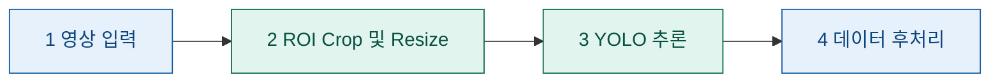
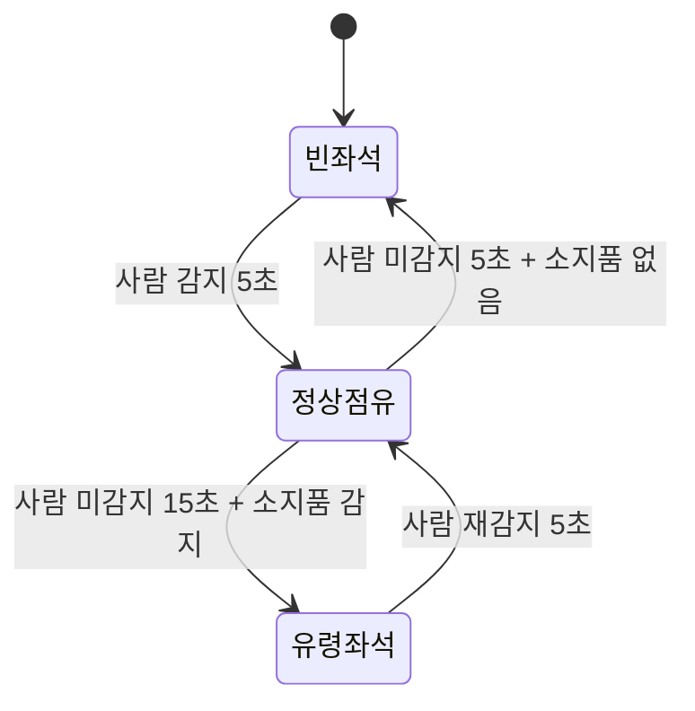

# KV260 기반 좌석 점유 탐지 시스템
> Vitis HLS로 구현한 ROI Crop과 DPU 기반 YOLO 추론을 결합한 좌석 점유 판별 파이프라인

## 개요
AMD Kria KV260 Vision AI Starter Kit을 사용해, 입력 영상에서 좌석 영역(ROI)을 잘라내고 YOLO 객체 탐지로 사람과 소지품을 검출하여 각 좌석의 점유 상태를 판별한다.

연산은 KV260의 **PS(ARM)** 와 **PL(FPGA fabric)** 에 나누어 배치한다. 무거운 연산(ROI Crop, YOLO 추론)은 PL에서 가속하고, 제어·전처리·후처리는 PS의 PYNQ 환경에서 수행한다.


### 배경 및 기대 효과
도서관·학교 스터디 공간에서는 일부 이용자가 소지품만 남긴 채 좌석을 장시간 비우는 '사석화'로 인해 실제 이용 가능한 좌석이 줄어드는 문제가 있다. 기존에는 직원이 직접 순찰하며 확인해야 했지만, 본 시스템을 도입하면 이 과정을 자동화해 좌석 회전율을 높이고 관리 인력 부담을 줄일 수 있을 것으로 기대된다.

## 시스템 구성
두 영역 모두 동일한 Zynq UltraScale+ MPSoC 안에 있으며, PS가 PL의 가속기(Crop IP, DPU)를 제어한다.

| 구분 | 위치 | 설명 |
|------|------|------|
| **외부** | PS (Processing System) | ARM Cortex-A53에서 동작하는 PYNQ(Python) 환경. resize, 좌표 매핑, 데이터 후처리 등 소프트웨어 처리를 담당 |
| **내부** | PL (Programmable Logic) | FPGA fabric. Vitis HLS로 구현한 ROI Crop IP와 DPU(YOLO 추론)가 배치됨 |

## 데이터 흐름


| 단계 | 처리 내용 | 수행 위치 | 구현 |
|:----:|-----------|-----------|------|
| 1 | 영상 데이터 입력 | 외부 (PS) | PYNQ |
| 2 | ROI Crop 및 Resize| 내부 (PL) | Vitis HLS |
| 3 | YOLO 추론 | 내부 (PL) | DPU |
| 4 | 데이터 후처리 | 외부 (PS) | python |


## 유령 좌석(사석) 판단 로직
5단계 후처리에서 YOLO 검출 결과를 바탕으로 좌석 상태를 판정한다.

**상태 정의**

| 상태 | 조건 |
|------|------|
| 정상점유 | 사람이 감지됨 |
| 빈좌석 | 사람 미감지 + 소지품 미감지 |
| 유령좌석 (사석 의심) | 사람이 15초간 연속 미감지 + 소지품 감지 |

**소지품 분류 클래스**: 겉옷, 가방, 물통, 휴대폰, 노트북, 태블릿, 공책 등



## 개발 환경
| 항목 | 내용 |
|------|------|
| 보드 | AMD Kria KV260 Vision AI Starter Kit |
| SoC | Zynq UltraScale+ MPSoC |
| 런타임 | PYNQ + DPU-PYNQ |
| HLS | Vitis HLS (ROI Crop IP 합성) |
| 가속기 | DPUCZDX8G (B4096 구성) |
| 모델 | YOLOv5n (COCO 사전학습 → 파인튜닝) |

## 모델 · IP 상세 스펙
| 항목 | 내용 |
|------|------|
| YOLO 모델 | YOLOv5n (nano) |
| 학습 | COCO 사전학습 모델을 좌석 소지품 클래스로 파인튜닝 |
| 양자화 | Vitis AI INT8 PTQ (Post-Training Quantization) |
| ROI Crop IP 인터페이스 | AXI4 Master (m_axi) |
| ROI Crop IP 리소스 | 최소화 방향으로 설계 (합성 결과는 측정 예정) |
| DPU | DPUCZDX8G, B4096 구성 |

## 성능 측정
전체 파이프라인의 **FPS**와 **후처리 단계 기준 성능**을 핵심 지표로 측정한다.

| 지표 | 설명 |
|------|------|
| 전체 FPS | 영상 입력부터 최종 좌석 상태 판정까지 end-to-end 처리 속도 |
| 후처리 성능 | 후처리 단계 소요 시간 및 판정 결과 기준 측정 |

## 실행 방법
1. Vitis HLS로 ROI Crop IP 합성
2. Crop IP + DPU 통합 IP 연결
3. 오버레이(.bit / .hwh) 생성
4. PYNQ에서 오버레이 로드 후 촬영 영상 기반 YOLO 추론 실행

## 테스트 시나리오 (데모 검증 계획)
| 시나리오 | 기대 결과 |
|----------|-----------|
| 정상 점유 | 사람이 있는 동안 정상점유 유지 |
| 소지품만 두고 장시간 이석 | 15초 경과 후 유령좌석(사석) 판정 |

> 원본 영상은 별도로 저장하지 않고 실시간 처리만 수행할 계획이다.

## 프로젝트 파일구조
```
.
├── hls/            # Vitis HLS ROI Crop IP 소스
│   └── roi_crop.cpp
├── overlay/        # DPU + Crop IP 통합 오버레이 (.bit, .hwh)
├── notebooks/      # PYNQ 실행 노트북 (전처리 · 추론 · 후처리)
├── src/            # C/C++ 후처리 코드
│   └── postprocess.c
├── models/         # YOLO xmodel
└── README.md
```

## 📁 프로젝트 함수구조
| 파일경로   | 설명                                       |
| ---------- | --------------------------------------------- |
| `models/`  | YOLO 학습·양자화 관련 · **담당: 재신**                   |
| `roi/`     | ROI crop 전처리 코드 · **담당: 다빈**              |
| `logic/`   | 유령 좌석 판단 상태머신 · **담당: 아현**                    |
| `deploy/`  | 보드 배포·VART 추론 스크립트 · **담당: 아현**               |
| `measure/` | 측정 로깅·분석 · **담당: 한빈**                         |
| `data/`    | 데이터·라벨 · **담당: 은형+한빈**<br>※ 용량이 큰 파일은 Git에 직접 업로드하지 않고 경로만 관리 |
| `docs/`    | 문서·리포트 · **담당: 은형**                           |
