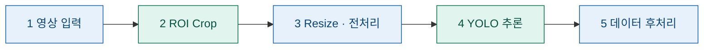

# KV260 기반 좌석 점유 탐지 시스템

> Vitis HLS로 구현한 ROI Crop과 DPU 기반 YOLO 추론을 결합한 좌석 점유 판별 파이프라인

## 개요

AMD Kria KV260 Vision AI Starter Kit을 사용해, 입력 영상에서 좌석 영역(ROI)을 잘라내고 YOLO 객체 탐지로 사람과 소지품을 검출하여 각 좌석의 점유 상태를 판별한다.

연산은 KV260의 **PS(ARM)** 와 **PL(FPGA 패브릭)** 에 나누어 배치한다. 무거운 연산(ROI Crop, YOLO 추론)은 PL에서 가속하고, 제어·전처리·후처리는 PS의 PYNQ 환경에서 수행한다.

## 시스템 구성

두 영역 모두 동일한 Zynq UltraScale+ MPSoC 안에 있으며, PS가 PL의 가속기(Crop IP, DPU)를 제어한다.

| 구분 | 위치 | 설명 |
|------|------|------|
| **외부** | PS (Processing System) | ARM Cortex-A53에서 동작하는 PYNQ(Python) 환경. resize, 좌표 매핑, 데이터 후처리 등 소프트웨어 처리를 담당 |
| **내부** | PL (Programmable Logic) | FPGA 패브릭. Vitis HLS로 구현한 ROI Crop IP와 DPU(YOLO 추론)가 배치됨 |

## 데이터 흐름



| 단계 | 처리 내용 | 수행 위치 | 구현 |
|:----:|-----------|-----------|------|
| 1 | 영상 데이터 입력 | 외부 (PS) | PYNQ |
| 2 | ROI Crop | 내부 (PL) | Vitis HLS |
| 3 | Resize 및 bounding box 전처리 | 외부 (PS) | PYNQ |
| 4 | YOLO 추론 | 내부 (PL) | DPU |
| 5 | 데이터 후처리 | 외부 (PS) | C/C++ |

> ※ 3단계의 bounding box 전처리는 crop된 ROI를 모델 입력 크기에 맞추는 letterbox 좌표 계산을 의미한다. 실제 검출 박스 디코딩은 5단계 후처리에서 수행된다.

## 개발 환경

| 항목 | 내용 |
|------|------|
| 보드 | AMD Kria KV260 Vision AI Starter Kit |
| SoC | Zynq UltraScale+ MPSoC |
| 런타임 | PYNQ + DPU-PYNQ |
| HLS | Vitis HLS (ROI Crop IP 합성) |
| 가속기 | DPUCZDX8G |
| 모델 | YOLO (COCO 사전학습) |

## 프로젝트 파일구조

```
.
├── hls/            # Vitis HLS ROI Crop IP 소스
│   └── roi_crop.cpp
├── overlay/        # DPU + Crop IP 통합 오버레이 (.bit, .hwh)
├── notebooks/      # PYNQ 실행 노트북 (전처리 · 추론 · 후처리)
├── src/            # C/C++ 후처리 코드
│   └── postprocess.c
├── models/         # YOLO xmodel
└── README.md
```

## 📁 프로젝트 함수구조

| 파일경로   | 설명                                       |
| ---------- | --------------------------------------------- |
| `models/`  | YOLO 학습·양자화 관련 · **담당: 재신**                   |
| `roi/`     | ROI crop 전처리 코드                               |
| `logic/`   | 유령 좌석 판단 상태머신 · **담당: 다빈**                    |
| `deploy/`  | 보드 배포·VART 추론 스크립트 · **담당: 아현**               |
| `measure/` | 측정 로깅·분석 · **담당: 한빈**                         |
| `data/`    | 데이터·라벨<br>※ 용량이 큰 파일은 Git에 직접 업로드하지 않고 경로만 관리 |
| `docs/`    | 문서·리포트 · **담당: 은형**                           |
